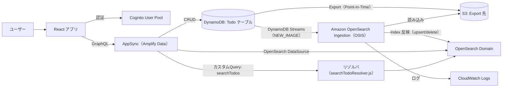

### OpenSearch 検索機能（Amplify Gen2）実装手順

### アーキテクチャ（全体像）



この構成では、CRUDの正本はDynamoDB（Todo）です。DynamoDB Streams/ExportをOSISが取り込み、OpenSearchへインデックスを同期します。検索はAppSyncのOpenSearchデータソース（カスタムQuery）経由でOpenSearchに投げます。

### 手順① OpenSearch連携の土台（DynamoDB→OSIS→OpenSearch）を構築する

### 手順①-1 TodoテーブルでStreamsを有効化する（OSIS取り込みの前提）

---

## 実際のコード貼り付け

```ts
const todoTable =
  backend.data.resources.cfnResources.amplifyDynamoDbTables["Todo"];

todoTable.pointInTimeRecoveryEnabled = true;
todoTable.streamSpecification = {
  streamViewType: dynamodb.StreamViewType.NEW_IMAGE,
};

const tableArn = backend.data.resources.tables["Todo"].tableArn;
const tableName = backend.data.resources.tables["Todo"].tableName;
```

---

## 概要（コードで何をしているかを３文程度で）

DynamoDB（Todo）にPoint-in-Time Recoveryを有効化します。DynamoDB StreamsをNEW_IMAGEで有効化し、OSISが変更イベントを購読できるようにします。後続のOSIS設定で使うために、テーブルのARNと名前を取り出します。

### 手順①-2 OpenSearchドメインを作成する

---

## 実際のコード貼り付け

```ts
const openSearchDomain = new opensearch.Domain(
  backend.data.stack,
  "OpenSearchDomain",
  {
    version: opensearch.EngineVersion.OPENSEARCH_2_11,
    capacity: {
      masterNodeInstanceType: "t3.small.search",
      masterNodes: 0,
      dataNodeInstanceType: "t3.small.search",
      dataNodes: 1,
    },
    nodeToNodeEncryption: true,
    removalPolicy: RemovalPolicy.DESTROY,
    encryptionAtRest: {
      enabled: true,
    },
  }
);
```

---

## 概要（コードで何をしているかを３文程度で）

OpenSearchの検索先となるDomainを作成します。開発用途の最小構成としてdata node 1台の構成にしています。暗号化とnode-to-node encryptionを有効化し、スタック削除時にDomainも削除される設定にしています。

### 手順①-3 OSISがDynamoDB/S3/OpenSearchへアクセスするためのIAMロールを作る

---

## 実際のコード貼り付け

```ts
const s3BucketArn = backend.storage.resources.bucket.bucketArn;
const s3BucketName = backend.storage.resources.bucket.bucketName;

const openSearchIntegrationPipelineRole = new iam.Role(
  backend.data.stack,
  "OpenSearchIntegrationPipelineRole",
  {
    assumedBy: new iam.ServicePrincipal("osis-pipelines.amazonaws.com"),
    inlinePolicies: {
      openSearchPipelinePolicy: new iam.PolicyDocument({
        statements: [
          new iam.PolicyStatement({
            actions: ["es:DescribeDomain"],
            resources: [
              openSearchDomain.domainArn,
              `${openSearchDomain.domainArn}/*`,
            ],
            effect: iam.Effect.ALLOW,
          }),
          new iam.PolicyStatement({
            actions: ["es:ESHttp*"],
            resources: [
              openSearchDomain.domainArn,
              `${openSearchDomain.domainArn}/*`,
            ],
            effect: iam.Effect.ALLOW,
          }),
          new iam.PolicyStatement({
            effect: iam.Effect.ALLOW,
            actions: [
              "s3:GetObject",
              "s3:AbortMultipartUpload",
              "s3:PutObject",
              "s3:PutObjectAcl",
            ],
            resources: [s3BucketArn, `${s3BucketArn}/*`],
          }),
          new iam.PolicyStatement({
            effect: iam.Effect.ALLOW,
            actions: [
              "dynamodb:DescribeTable",
              "dynamodb:DescribeContinuousBackups",
              "dynamodb:ExportTableToPointInTime",
              "dynamodb:DescribeExport",
              "dynamodb:DescribeStream",
              "dynamodb:GetRecords",
              "dynamodb:GetShardIterator",
            ],
            resources: [tableArn, `${tableArn}/*`],
          }),
        ],
      }),
    },
    managedPolicies: [
      iam.ManagedPolicy.fromAwsManagedPolicyName(
        "AmazonOpenSearchIngestionFullAccess"
      ),
    ],
  }
);
```

---

## 概要（コードで何をしているかを３文程度で）

OSISパイプラインが利用するIAMロールを作成します。OpenSearchへのHTTPアクセス、DynamoDB Streams/Export関連、S3（export先）へのアクセス権限を付与します。マネージドポリシーも付けてOSIS実行に必要な権限を補完します。

### 手順①-4 OpenSearchインデックス設定とOSISパイプライン設定（YAMLテンプレート）を作る

---

## 実際のコード貼り付け

```ts
const indexName = "todo";

const indexMapping = {
  settings: {
    number_of_shards: 1,
    number_of_replicas: 0,
  },
  mappings: {
    properties: {
      id: {
        type: "keyword",
      },
      content: {
        type: "text",
      },
      status: {
        type: "keyword",
      },
      createdAt: {
        type: "date",
      },
    },
  },
};

const openSearchTemplate = `
version: "2"
dynamodb-pipeline:
  source:
    dynamodb:
      acknowledgments: true
      tables:
        - table_arn: "${tableArn}"
          stream:
            start_position: "LATEST"
          export:
            s3_bucket: "${s3BucketName}"
            s3_region: "${backend.storage.stack.region}"
            s3_prefix: "${tableName}/"
      aws:
        sts_role_arn: "${openSearchIntegrationPipelineRole.roleArn}"
        region: "${backend.data.stack.region}"
  sink:
    - opensearch:
        hosts:
          - "https://${openSearchDomain.domainEndpoint}"
        index: "${indexName}"
        index_type: "custom"
        template_content: |
          ${JSON.stringify(indexMapping)}
        document_id: '\${getMetadata("primary_key")}'
        action: '\${getMetadata("opensearch_action")}'
        document_version: '\${getMetadata("document_version")}'
        document_version_type: "external"
        bulk_size: 4
        aws:
          sts_role_arn: "${openSearchIntegrationPipelineRole.roleArn}"
          region: "${backend.data.stack.region}"
`;
```

---

## 概要（コードで何をしているかを３文程度で）

OpenSearch側のインデックス（`todo`）で使うmappingを定義します。OSISのパイプラインテンプレート（YAML）で、DynamoDB StreamsとExport（S3）をsourceとして、OpenSearchをsinkとして接続します。document_idやaction/versionをメタデータから取り出し、更新/削除も反映できる形にしています。

### 手順①-5 OSISパイプラインを作成し、AppSyncにOpenSearchデータソースを追加する

---

## 実際のコード貼り付け

```ts
const logGroup = new logs.LogGroup(backend.data.stack, "LogGroup", {
  logGroupName: "/aws/vendedlogs/OpenSearchService/pipelines/1",
  removalPolicy: RemovalPolicy.DESTROY,
});

new osis.CfnPipeline(backend.data.stack, "OpenSearchIntegrationPipeline", {
  maxUnits: 4,
  minUnits: 1,
  pipelineConfigurationBody: openSearchTemplate,
  pipelineName: "dynamodb-integration-2",
  logPublishingOptions: {
    isLoggingEnabled: true,
    cloudWatchLogDestination: {
      logGroup: logGroup.logGroupName,
    },
  },
});

backend.data.addOpenSearchDataSource("osDataSource", openSearchDomain);
```

---

## 概要（コードで何をしているかを３文程度で）

OSISパイプラインのログ出力先としてCloudWatch LogsのLogGroupを作成します。テンプレートを渡してOSISのパイプライン（DynamoDB→OpenSearch）を実体化します。最後にAppSync（Amplify Data）にOpenSearchデータソースを追加し、検索リゾルバから参照できるようにします。

### 手順② AppSync(Data)のスキーマに検索Queryを追加する

---

## 実際のコード貼り付け

```ts
import { type ClientSchema, a, defineData } from "@aws-amplify/backend";

const schema = a.schema({
  Todo: a
    .model({
      content: a.string(),
      status: a.enum(["PENDING", "COMPLETED"]),
      createdAt: a.datetime(),
    })
    .secondaryIndexes((index) => [
      index("status").sortKeys(["createdAt"]).queryField("todosByStatus"),
    ])
    .authorization((allow) => [allow.authenticated()]),

  searchTodos: a
    .query()
    .arguments({
      term: a.string(),
    })
    .returns(a.ref("Todo").array())
    .authorization((allow) => [allow.authenticated()])
    .handler(
      a.handler.custom({
        entry: "./searchTodoResolver.js",
        dataSource: "osDataSource",
      })
    ),
});

export type Schema = ClientSchema<typeof schema>;

export const data = defineData({
  schema,
  authorizationModes: {
    defaultAuthorizationMode: "userPool",
  },
});
```

---

## 概要（コードで何をしているかを３文程度で）

`searchTodos`というカスタムQueryをスキーマに追加し、戻り値を`Todo[]`として定義します。実処理は`./searchTodoResolver.js`に委譲し、`osDataSource`（OpenSearchデータソース）を通してOpenSearchへリクエストします。認可は`allow.authenticated()`にしているため、UserPoolで認証済みの呼び出しだけが実行できます。

### 手順③ OpenSearchへ検索リクエストするリゾルバを追加する

---

## 実際のコード貼り付け

```js
import { util } from "@aws-appsync/utils";

export function request(ctx) {
  const term = ctx.args.term;

  const body = term
    ? {
        query: {
          multi_match: {
            query: term,
            fields: ["content", "status"],
          },
        },
      }
    : {
        query: {
          match_all: {},
        },
      };

  return {
    operation: "POST",
    path: "/todo/_search",
    params: {
      body,
    },
  };
}

export function response(ctx) {
  if (ctx.error) {
    util.error(ctx.error.message, ctx.error.type);
  }

  return ctx.result.hits.hits.map((hit) => hit._source);
}
```

---

## 概要（コードで何をしているかを３文程度で）

AppSyncのリゾルバで`term`引数を受け取り、OpenSearch Query DSLの`multi_match`（未指定なら`match_all`）を組み立てます。`/todo/_search`へ`POST`して検索を実行し、戻り値の`hits.hits`から`_source`だけを配列に変換して返します。エラーがある場合は`util.error`でAppSyncエラーとして返し、クライアント側に失敗として伝播します。
